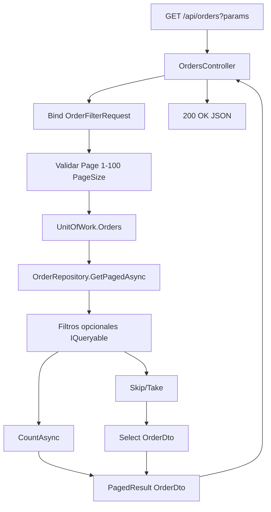

# Plan: Endpoint GET /api/orders paginado

## Contexto asumido

- Proyecto .NET 8 existente con Entity Framework Core 8
- Entidad `Order` con: Id, CustomerId, OrderDate, TotalAmount, Status (enum)
- `BaseRepository<T>` con GetAll(), GetById(), Add(), Update()
- Patrón Unit of Work con `IOrderRepository` / `OrderRepository`
- Enum `OrderStatus`: Pending, Shipped, Delivered, Cancelled
- Paginación: página base 1, 100 items por defecto, máximo 100 por página

## Estructura de archivos a crear en sesion_2/

```
sesion_2/
├── dtos/
│   ├── OrderFilterRequest.cs
│   ├── OrderDto.cs
│   └── PagedResult.cs
├── repositories/
│   └── IOrderRepository.cs          (añadir firma GetPagedAsync)
│   └── OrderRepository.cs            (implementar GetPagedAsync)
└── controllers/
    └── OrdersController.cs
```

---

## 1. OrderFilterRequest (DTO de request)

Propiedades opcionales e independientes:

- `CustomerId` (Guid?)
- `Status` (OrderStatus?)
- `DateFrom` (DateTime?)
- `DateTo` (DateTime?)
- `Page` (int, default 1)
- `PageSize` (int, default 20, max 100)

Validación: Page >= 1, PageSize entre 1 y 100.

---

## 2. OrderDto (DTO de response para cada item)

- Id, CustomerId, OrderDate, TotalAmount, Status

---

## 3. PagedResultT (DTO genérico de response)

- `Items` (IEnumerableT)
- `TotalCount` (int)
- `Page` (int)
- `PageSize` (int)
- `TotalPages` (int, calculado)

---

## 4. Método del repositorio

**IOrderRepository**: añadir `Task<PagedResult<OrderDto>> GetPagedAsync(OrderFilterRequest request, CancellationToken ct = default)`.

**OrderRepository** (extiende BaseRepositoryOrder):

- Construir `IQueryable<Order>` aplicando filtros opcionales:
  - CustomerId: `Where(x => x.CustomerId == request.CustomerId)`
  - Status: `Where(x => x.Status == request.Status)`
  - DateFrom: `Where(x => x.OrderDate >= request.DateFrom)`
  - DateTo: `Where(x => x.OrderDate <= request.DateTo)`
- Contar total con `CountAsync()`
- Aplicar `OrderBy(x => x.OrderDate)` (o Id) para orden estable
- Aplicar `Skip((Page - 1) * PageSize).Take(PageSize)`
- Proyectar a `OrderDto` con `Select()`
- Sin `Include()` de navegaciones
- Comentarios XML en el método público

---

## 5. Endpoint del controller

**GET /api/orders**

- Query params: CustomerId, Status, DateFrom, DateTo, Page, PageSize
- Binding desde query string a `OrderFilterRequest`
- Llamar a `_unitOfWork.Orders.GetPagedAsync(request)`
- Devolver `Ok(PagedResult<OrderDto>)`
- Comentarios XML en el método

---

## Diagrama de flujo




---

## Consideraciones técnicas

- **Namespace**: Asumir `TuProyecto.Api` o similar; habrá que ajustar al namespace real del proyecto.
- **IOrderRepository**: Si ya existe, solo se añade la firma `GetPagedAsync`. Si no existe, se crea la interfaz completa.
- **Unit of Work**: Se asume que expone `IOrderRepository Orders { get; }`.
- **BaseRepository**: Se asume que expone `DbSet<Order>` o `IQueryable<Order>` (por ejemplo vía propiedad protegida) para poder construir la query en OrderRepository.

---

## Archivos a generar


| Archivo                                     | Acción                                     |
| ------------------------------------------- | ------------------------------------------ |
| `sesion_2/DTOs/OrderFilterRequest.cs`       | Crear                                      |
| `sesion_2/DTOs/OrderDto.cs`                 | Crear                                      |
| `sesion_2/DTOs/PagedResult.cs`              | Crear                                      |
| `sesion_2/Repositories/IOrderRepository.cs` | Crear (o documento con el método a añadir) |
| `sesion_2/Repositories/OrderRepository.cs`  | Crear con GetPagedAsync                    |
| `sesion_2/Controllers/OrdersController.cs`  | Crear                                      |


Los archivos se generarán listos para copiar e integrar en el proyecto .NET existente, con namespaces placeholder que el usuario podrá ajustar.