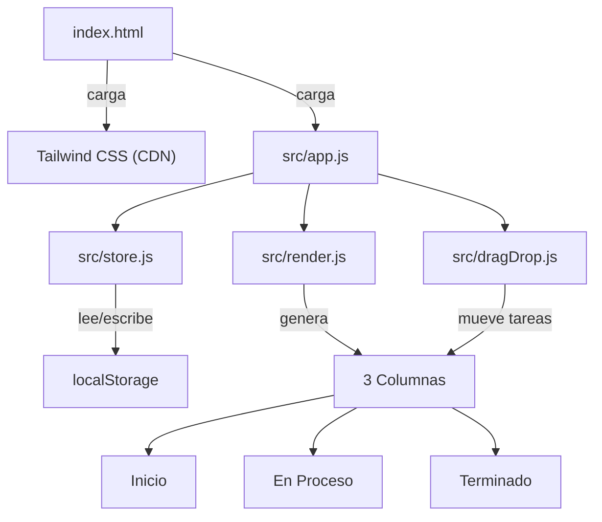

# Plan: Panel Kanban en Vanilla JavaScript

## Arquitectura del proyecto



## Estructura de archivos

```
proyecto_cli_js/
  index.html
  src/
    app.js          # Punto de entrada, inicializa la app
    store.js        # CRUD de tareas + localStorage
    render.js       # Renderizado del DOM (columnas, tareas, formulario)
    dragDrop.js     # Lógica de drag and drop HTML5
```

## Modelo de datos (localStorage)

```javascript
// Cada tarea almacenada en un array bajo la key "kanban-tasks"
{
  id: crypto.randomUUID(),
  title: "Nombre de la tarea",
  column: "inicio" | "en-proceso" | "terminado",
  createdAt: Date.now()
}
```

---

## Paso 1: Configuración del proyecto y estructura base

- Crear `index.html` con Tailwind CSS cargado por CDN
- Crear la carpeta `src/` con los 4 archivos JS como módulos ES
- Configurar el HTML base con el layout de 3 columnas usando Tailwind (grid de 3 cols)
- Incluir el formulario de creación de tareas en el HTML

## Paso 2: Store - Gestión de estado y persistencia

- Crear `src/store.js` con funciones documentadas con JSDoc:
  - `getTasks()` - Lee las tareas desde localStorage
  - `saveTasks(tasks)` - Guarda el array de tareas en localStorage
  - `addTask(title)` - Crea una nueva tarea en la columna "inicio"
  - `moveTask(taskId, newColumn)` - Mueve una tarea a otra columna
  - `deleteTask(taskId)` - Elimina una tarea

## Paso 3: Render - Renderizado dinámico del DOM

- Crear `src/render.js` con funciones para:
  - `renderBoard()` - Renderiza las 3 columnas con sus tareas correspondientes
  - `createTaskCard(task)` - Genera el HTML de una tarjeta con atributo `draggable="true"` y estilos Tailwind
  - Cada tarjeta mostrará el título y un botón para eliminar la tarea

## Paso 4: Drag and Drop - API nativa HTML5

- Crear `src/dragDrop.js` con la lógica de arrastrar y soltar:
  - `initDragAndDrop()` - Inicializa los event listeners en las columnas
  - Eventos en las tarjetas: `dragstart` (guarda el id de la tarea en `dataTransfer`)
  - Eventos en las columnas: `dragover`, `dragenter`/`dragleave`, `drop`
  - Feedback visual: resaltar la columna destino cuando se arrastra sobre ella

## Paso 5: Integración, formulario y punto de entrada

- Crear `src/app.js` como orquestador:
  - Inicializa el renderizado del board al cargar la página
  - Conecta el formulario con `addTask()` y re-renderiza
  - Conecta los botones de eliminar con `deleteTask()` y re-renderiza
  - Conecta el drag and drop llamando a `initDragAndDrop()` después de cada render
  - Validación básica del formulario (campo no vacío)
